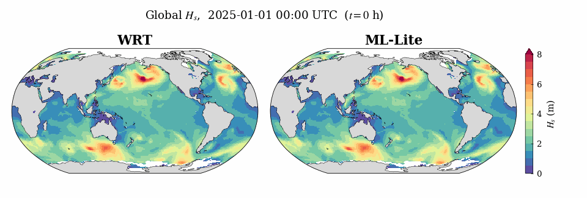

# WW3-ML-Snl: machine-learning surrogate for the nonlinear four-wave interaction in WAVEWATCH III

This package couples a machine-learning surrogate for the nonlinear four-wave
interaction (`S_nl`) into **WAVEWATCH III v7.14**. The surrogate replaces the
Discrete Interaction Approximation (DIA) as a new source-term option (`NL6`)
and is evaluated at run time through the ONNX Runtime C API.


*One command from a clean Linux machine: install prerequisites, clone, build, and run a
1-hour global WAVEWATCH III simulation with the ML-Lite `S_nl` surrogate
(playback sped up 4x).*

Three trained surrogates are bundled:

| Model | File (`ml_models/`) | Description |
|-------|---------------------|-------------|
| ML       | `unet_faster_24x40_base32_deep.onnx` | Base surrogate (32/64/128 ch), depth-scaled, tuned for accuracy |
| ML-Lite  | `unet_faster_24x40_base16.onnx`      | Lightweight surrogate (16/32 ch), tuned for fast inference |
| ML-FiLM  | `cond_unet_film_24x40.onnx`          | Depth-conditioned surrogate, reproduces the finite-depth interaction |

ML and ML-Lite emulate the depth-scaled Webb-Resio-Tracy (WRT) transfer
(IQTYPE 2) and share one single-input module. ML-FiLM emulates the finite-depth
WRT (IQTYPE 3) directly and uses a two-input (spectrum + depth) module, provided
in `finite_depth_film/` as a drop-in variant.



*Global significant wave height over 14 days (January 2025): the WRT reference
(left) and the ML-Lite `S_nl` surrogate (right) running inside WAVEWATCH III. The
surrogate reproduces the WRT field at ~53x lower cost (2.5x the cost of DIA).*

## Quick start

Requires a Fortran and C compiler, CMake, MPI, and NetCDF.

**One command** (clone, then run the helper script that downloads ONNX Runtime,
builds, and runs a 1-hour global example with ML-Lite):

```sh
git clone https://github.com/Jialunx/WW3-ML-Snl.git
cd WW3-ML-Snl
bash quickstart.sh
```

Or run the steps manually:

```sh
# 1. get the code
git clone https://github.com/Jialunx/WW3-ML-Snl.git
cd WW3-ML-Snl

# 2. get ONNX Runtime (prebuilt, CPU)
ORT_VER=1.20.1
curl -L https://github.com/microsoft/onnxruntime/releases/download/v${ORT_VER}/onnxruntime-linux-x64-${ORT_VER}.tgz | tar xz
export ORT=$PWD/onnxruntime-linux-x64-${ORT_VER}

# 3. build with the ML surrogate (NL6)
cmake -S . -B build -DSWITCH=NL6_ML -DORT_ROOT=$ORT
cmake --build build -j

# 4. run the 1-hour global example with ML-Lite
cd example_global
export LD_LIBRARY_PATH=$ORT/lib:$LD_LIBRARY_PATH
export WW3_SNL_ONNX_MODEL=$PWD/../ml_models/unet_faster_24x40_base16.onnx
mpirun -np 1 ../build/bin/ww3_grid     # -> mod_def.ww3
mpirun -np 1 ../build/bin/ww3_prnc     # bundled ERA5 wind -> wind.ww3
mpirun -np 4 ../build/bin/ww3_shel     # ML computes S_nl
```

A successful run prints `[ort_wrapper] rank 0: ort_forward calls = ...` and
`End of program`. For ML use `unet_faster_24x40_base32_deep.onnx`; the ML-FiLM
model needs the finite-depth build (see `finite_depth_film/`).

The global example (`example_global/`) uses a real 1-degree grid with a bundled
ERA5 wind field, and can run from a 1-hour test up to a multi-day period (set
`DOMAIN%STOP` in `ww3_shel.nml`). By default it warm-starts from the paper's ERA5
spin-up initial condition (`restart_ic_20250101.ww3`, auto-downloaded), so the
first output is an already-developed global wave field rather than a calm sea;
this is the run shown in the animation above. Set `WARM=0 bash run_global.sh` to
cold-start from calm instead. For a lighter local check, `example_fetch/` runs a
small fetch-limited basin with homogeneous wind in about 30 seconds.

## Output

`ww3_shel` writes raw binary (`out_grd.ww3`, `out_pnt.ww3`) in the run
directory. Convert to NetCDF from the same folder with `ww3_ounf` / `ww3_ounp`
(in `build/bin/`):

```sh
mpirun -np 1 ../build/bin/ww3_ounf    # gridded fields -> ww3.YYYYMM.nc
mpirun -np 1 ../build/bin/ww3_ounp    # point spectra  -> ww3.YYYYMM_spec.nc
```

The gridded file holds the bulk parameters listed in `FIELD%LIST` in
`ww3_shel.nml` (here `HS T02 FP DIR SPR DPT`):

| Field | Meaning | Unit |
|-------|---------|------|
| `HS`  | significant wave height | m |
| `T02` | mean period (m0/m2) | s |
| `FP`  | peak frequency | Hz |
| `DIR` | mean direction | deg |
| `SPR` | directional spread | deg |
| `DPT` | water depth | m |

The point file (`ww3.*_spec.nc`) holds the 2-D spectrum `F(f,theta)` at the
stations in `points.list`.

### Source terms (including the ML `S_nl`)

Source terms come from the point output with `POINT%TYPE = 3`. Each example
ships a `ww3_ounp_src.nml` for this:

```sh
cp ww3_ounp_src.nml ww3_ounp.nml
mpirun -np 1 ../build/bin/ww3_ounp    # -> ww3.YYYYMM_src.nc
```

`ww3.*_src.nc` contains `snl` (the ML `S_nl`), `sin` (wind input), `sds`
(dissipation), `stt` (total), and `efth` (spectrum), each as `F(f,theta)` at the
`points.list` stations. `ww3_ounp`/`ww3_ounf` also load the surrogate, so keep
`WW3_SNL_ONNX_MODEL` and `LD_LIBRARY_PATH` set when running them.

## Repository layout

```
WW3-ML-Snl-v1.0/
  CMakeLists.txt, cmake/, model/, VERSION   WAVEWATCH III v7.14 source tree
  model/src/w3snl6md.F90                     ML S_nl module (NL6), depth-scaled (ML / ML-Lite)
  model/src/ort/ort_wrapper.{c,h}            ONNX Runtime C wrapper (single input)
  model/bin/switch_NL6_ML                    compile switch enabling NL6
  ml_models/                                 the three trained ONNX weights + training notebooks
  finite_depth_film/                         drop-in files for the ML-FiLM build
  example_fetch/                             ready-to-run local fetch case
  example_global/                            ready-to-run global case (real ERA5 wind bundled)
  LICENSE.md                                 WAVEWATCH III license
```

## Dependencies

- A Fortran and C compiler (GNU or Intel), CMake >= 3.19
- MPI (the bundled switch uses `DIST MPI`)
- NetCDF (Fortran + C)
- [ONNX Runtime](https://onnxruntime.ai) (C/C++ build). A build providing the
  DNNL execution provider is recommended for CPU performance. Set `ORT_ROOT`
  to the install directory (it must contain `include/` and `lib/`).

## Build (ML / ML-Lite, depth-scaled)

```sh
cmake -S . -B build \
      -DSWITCH=NL6_ML \
      -DORT_ROOT=/path/to/onnxruntime
cmake --build build -j
```

This produces the standard WW3 programs (`ww3_grid`, `ww3_shel`, `ww3_ounf`,
...) linked against the ML `S_nl` module. The `NL6` token in the switch selects
the surrogate as the nonlinear source term.

## Selecting a model at run time

The active `.onnx` file is chosen by the environment variable
`WW3_SNL_ONNX_MODEL`. If unset, the module falls back to the bundled default
(`ml_models/unet_faster_24x40_base32_deep.onnx`). Paths are resolved relative to
the run directory, so run WW3 from a directory that contains `ml_models/`, or
give an absolute path.

```sh
# ML (base, depth-scaled)   -- default
export WW3_SNL_ONNX_MODEL=ml_models/unet_faster_24x40_base32_deep.onnx

# ML-Lite (lightweight, depth-scaled)
export WW3_SNL_ONNX_MODEL=ml_models/unet_faster_24x40_base16.onnx
```

ML and ML-Lite share the same compiled binary. Only the environment variable
changes.

## Build for the finite-depth surrogate (ML-FiLM)

ML-FiLM uses a different module and wrapper because it feeds water depth to the
network in addition to the spectrum. Swap the two source files in, then rebuild:

```sh
cp finite_depth_film/w3snl6md.F90 model/src/w3snl6md.F90
cmake -S . -B build_film -DSWITCH=NL6_ML -DORT_ROOT=/path/to/onnxruntime -DWW3_SNL_VARIANT=film
cmake --build build_film -j
export WW3_SNL_ONNX_MODEL=ml_models/cond_unet_film_24x40.onnx
```

The two-input FiLM wrapper ships in `model/src/ort/`; `-DWW3_SNL_VARIANT=film`
selects it. Only the module (`w3snl6md.F90`) has to be copied in.

See `finite_depth_film/README.md` for details. The trained models operate on a
24-direction by 40-frequency spectral grid, matching the configuration used in
the paper.

## Training

The notebooks used to train the bundled weights are in `ml_models/`:

- `train_ML_and_MLLite.ipynb` trains the depth-scaled surrogates (ML, `base_ch=32`;
  ML-Lite, `base_ch=16`) on deep-water WRT labels.
- `train_ML_FiLM.ipynb` trains the depth-conditioned ML-FiLM surrogate on
  finite-depth WRT labels.

Each notebook covers data loading, preprocessing and normalization, and training.
The training data (energy-density spectra, `S_nl` targets, and depth, as CSV files)
is not distributed with this package. Set the data directory variables at the top
of each notebook to point at your own copy.

## Attribution

WAVEWATCH III is developed by NOAA/NCEP and the WAVEWATCH III Development Group
and is distributed under the license in `LICENSE.md`. This package adds the
`NL6` machine-learning `S_nl` source term (`model/src/w3snl6md.F90`, the ONNX
Runtime wrapper, and the trained weights) on top of an unmodified WW3 v7.14
tree. All other source files are as distributed by WW3.

## Citation

If you use this software, please cite the accompanying paper by
Chen, J., Adcock, T. A. A., Liu, Q., Clark, R., & Tang, T.
