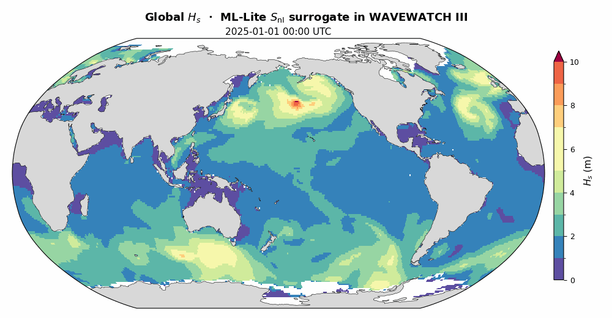

# Global example: 1-degree global run

ML `S_nl` surrogate on a realistic global grid (1 deg, 360 x 181), forced by
ERA5 wind. Spectral grid is 24 x 40 (fixed by the networks). Use ML or ML-Lite;
ML-FiLM is for finite-depth idealized cases only.

## Files
- `ww3_grid.nml`, `namelists_Global-real.nml`: grid + spectral definition
- `Global-real.depth`: 1-degree global bathymetry
- `wind_example.nc`: real ERA5 wind, 2025-01-01 (24 h), bundled
- `ww3_prnc.nml`, `ww3_shel.nml`, `points.list`: run configuration
- `run_global.sh`: build-and-run helper
- `download_era5_wind.py`: optional, for the full multi-day ERA5 wind
- `restart.ww3`: warm-start IC (auto-downloaded by `run_global.sh`; the paper's 2025-01-01 spin-up)

## Run

The bundled `wind_example.nc` lets this run with no download or account:

```sh
sudo apt install -y build-essential gfortran cmake libopenmpi-dev libnetcdf-dev libnetcdff-dev curl git
git clone https://github.com/Jialunx/WW3-ML-Snl.git && cd WW3-ML-Snl/example_global
bash run_global.sh          # ML-Lite; MODEL=unet_faster_24x40_base32_deep.onnx for ML
```

`run_global.sh` gets ONNX Runtime, builds if needed, fetches the paper's spin-up
initial condition, then runs `ww3_grid -> ww3_prnc -> ww3_shel`. It **warm-starts
from the same ERA5 spin-up state as the paper** (`restart_ic_20250101.ww3`, valid
2025-01-01 00:00 UTC), so the first output is an already-developed global wave
field. Output goes to `ww3.*.nc`. Set `WARM=0 bash run_global.sh` to cold-start
from calm instead. If the repo is already cloned, `cd WW3-ML-Snl && git pull` first.



## Manual build and run

```sh
# build (repo root)
cd ..
ORT_VER=1.20.1
curl -L https://github.com/microsoft/onnxruntime/releases/download/v${ORT_VER}/onnxruntime-linux-x64-${ORT_VER}.tgz | tar xz
export ORT=$PWD/onnxruntime-linux-x64-${ORT_VER}
cmake -S . -B build -DSWITCH=NL6_ML -DORT_ROOT=$ORT && cmake --build build -j

# run (this folder)
cd example_global
export LD_LIBRARY_PATH=$ORT/lib:$LD_LIBRARY_PATH
export WW3_SNL_ONNX_MODEL=$PWD/../ml_models/unet_faster_24x40_base16.onnx
curl -fL https://github.com/Jialunx/WW3-ML-Snl/releases/download/v1.1/restart_ic_20250101.ww3 -o restart.ww3  # warm-start IC (optional)
mpirun -np 1 ../build/bin/ww3_grid
mpirun -np 1 ../build/bin/ww3_prnc
mpirun -np 4 ../build/bin/ww3_shel     # warm-starts from restart.ww3 if present, else cold start
```

## Period

Set `DOMAIN%STOP` in `ww3_shel.nml` (the wind must cover it):
1 h `20250101 010000` · 24 h (bundled wind) `20250102 000000`.

For longer runs, fetch the full ERA5 wind (free CDS account, key in `~/.cdsapirc`):
```sh
python3 -m venv ~/cds-venv && ~/cds-venv/bin/pip install cdsapi xarray netcdf4
~/cds-venv/bin/python download_era5_wind.py
```
then point `FILE%FILENAME` in `ww3_prnc.nml` at it and widen `FORCING%TIMESTOP`.

## Notes
- Switch model via `WW3_SNL_ONNX_MODEL`, no rebuild.
- Cost scales with grid: a 1 h global step took ~2.5 min on 4 MPI ranks.

## Output

Raw output (`out_grd.ww3`, `out_pnt.ww3`) is written here. Convert to NetCDF
(keep `WW3_SNL_ONNX_MODEL` and `LD_LIBRARY_PATH` set, as `ww3_ounf`/`ww3_ounp`
also load the surrogate):

```sh
mpirun -np 1 ../build/bin/ww3_ounf                 # bulk fields -> ww3.*.nc (HS, T02, ...)

cp ww3_ounp_src.nml ww3_ounp.nml
mpirun -np 1 ../build/bin/ww3_ounp                 # source terms -> ww3.*_src.nc
```

`ww3.*_src.nc` holds `snl` (the ML `S_nl`), `sin`, `sds`, `stt`, and `efth`,
each as `F(f,theta)` at the `points.list` stations.
